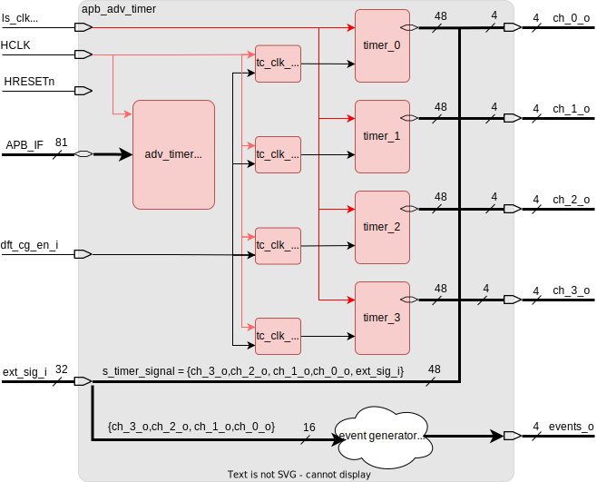
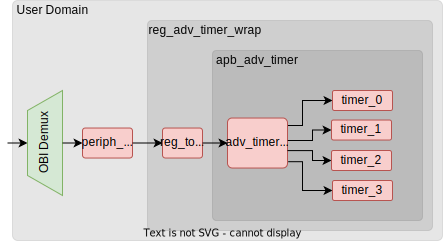
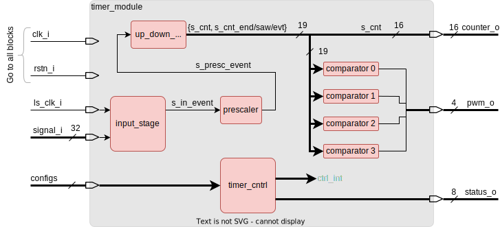

# APB Advanced Timer

## Overview

The **APB Advanced Timer** is a timer module designed to interface with an **APB bus**. It consists of multiple timer blocks, each capable of independently counting based on configurable settings.

This README describes the configuration and block diagrams of the APB Advanced Timer, along with how it can be integrated into a system using the **OBI (Open Bus Interface)**.

---

## Block Diagram: APB Advanced Timer Top View

The following diagram provides a top view of the **APB Advanced Timer**.

Note: To avoid too many connections, the configuration lines from `adv_timer_apb_if` to the timers and to the event logic are missing.

---

## Block Diagram: APB Advanced Timer with OBI Interface

The following diagram illustrates how to instantiate the `apb_adv_timer` component when using **OBI**.

---

## Block Diagram: Timer Module

The APB Advanced Timer module consists of **four independent timer blocks**. Each of these blocks is configured with signals coming from the `ctrl_int` (internal control signals) signal, which dictates their behavior and operation.

For simplicity, the configuration connections are not shown in the diagram to avoid visual clutter.

---

## Key Features

- **Four Independent Timer Blocks**: The module features four distinct timer blocks that can operate in parallel, providing flexibility for handling multiple time-based tasks in your system.
- **APB Interface**: The **apb_adv_timer** is designed with an **APB interface** for easy integration with an APB-based system.
- **OBI Bus Integration**: Although the timer itself uses an APB interface, this module can be connected to an **OBI bus** to allow for greater system-wide communication and control.
- **Flexible Configuration**: Each timer block can be independently configured to handle various timing requirements, such as different clock sources or time intervals.

---

## Conclusion

The **APB Advanced Timer** is a versatile solution for time-based operations in embedded systems. With its **APB interface** and the ability to be connected to the **OBI bus**, it allows for high-performance, flexible time control. The four independent timer blocks further enhance its versatility, enabling multiple simultaneous time-based operations.

For detailed configuration or additional implementation examples, please refer to the documentation linked below.
