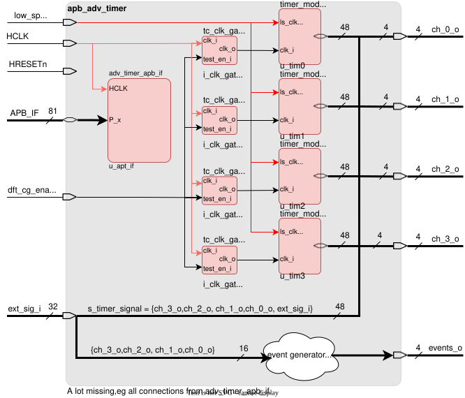
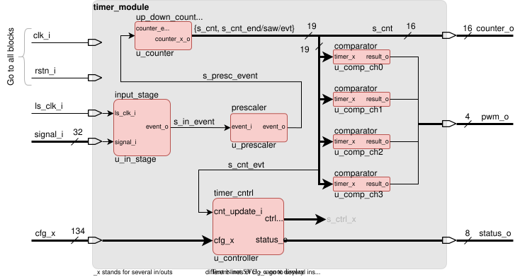
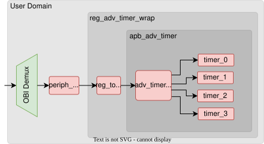

# APB Advanced Timer

## Overview

The **APB Advanced Timer** is a highly flexible timer module designed for integration with an **APB (Advanced Peripheral Bus)**. It consists of multiple independent timer blocks, each capable of counting based on configurable settings.

This README provides an overview of the APB Advanced Timer, its block diagrams, and how it can be seamlessly integrated into your system using the **OBI (Open Bus Interface)**.

---

## Block Diagrams

### APB Advanced Timer Top View

The following diagram provides a top-level view of the **APB Advanced Timer** module. This diagram shows the general structure of the timer, though some configuration connections (e.g., from `adv_timer_apb_if` to the timers and event logic) have been omitted for clarity.

---

### Timer Module Overview

The **APB Advanced Timer** module contains **four independent timer blocks**. These blocks are controlled by internal signals (`s_ctrl_x`), which govern their operation. This allows each timer block to function independently, providing great flexibility for time-based operations.

Note that the configuration signals (`cfg_x`) and control signals (`s_ctrl_x`) are omitted from the diagram to reduce visual complexity.

---

### APB Advanced Timer with OBI Interface

This diagram illustrates how to instantiate the **apb_adv_timer** component when integrating with an **OBI (Open Bus Interface)**. The `reg_adv_timer_wrap.sv` file includes the wrapping logic required for this interface, ensuring smooth connectivity between the APB Advanced Timer and an OBI-compatible system.

---

## Key Features

- **Four Independent Timer Blocks**: The APB Advanced Timer features four distinct timer blocks, each capable of operating independently. This allows for parallel execution of multiple timing tasks.

- **APB Interface**: Designed with an **APB interface**, the timer module is easy to integrate into APB-based systems, ensuring seamless communication with other components.

- **OBI Bus Integration**: In addition to the APB interface, the timer can be connected to an **OBI bus** using the [Wrapper](rtl/reg_adv_timer_wrap.sv) file. This enhances its versatility in a range of system configurations.

- **Flexible Configuration**: Each timer block can be independently configured with various parameters, such as different time intervals, allowing for precise control over time-based operations.

---

## Conclusion

The **APB Advanced Timer** provides a powerful and flexible solution for managing time-based operations in embedded systems. With its four independent timer blocks, **APB interface**, and support for **OBI bus integration**, it offers unparalleled versatility for time-critical tasks.

For detailed configuration options or additional implementation examples, please refer to the documentation linked below.

---

## References

- [Advanced Peripheral Bus (APB) Pulp on Github](https://github.com/pulp-platform/apb)
- [OBI Bus (Pulp Github)](https://github.com/pulp-platform/obi)
